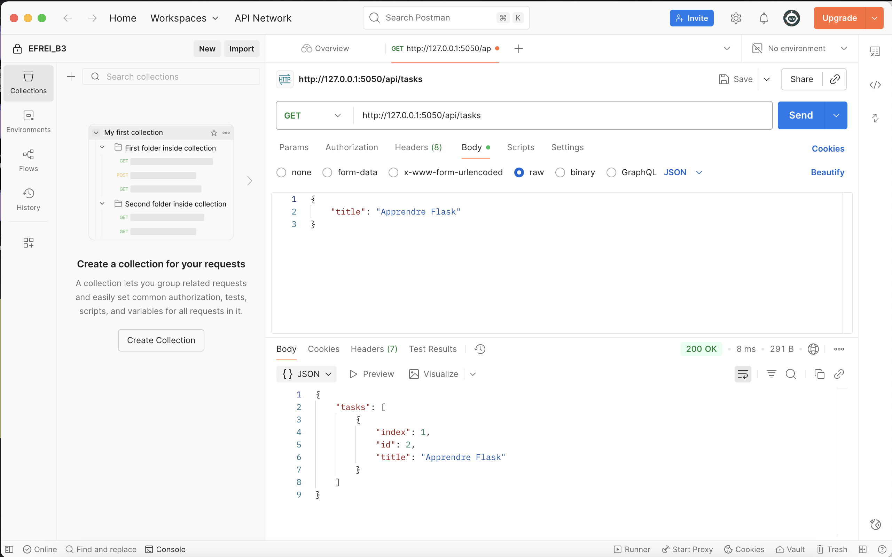
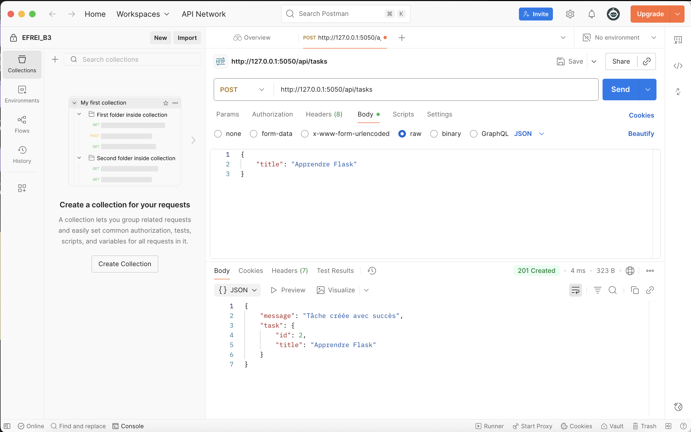
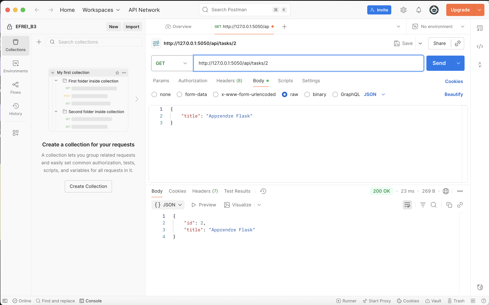
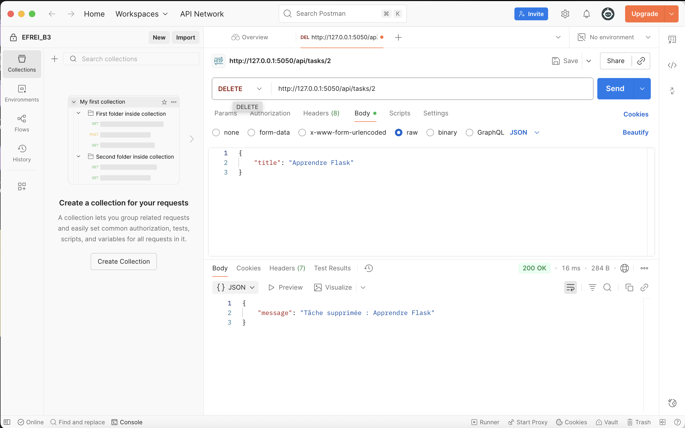

# ToDoList

Une application **API REST** développée avec **Express.js (Node.js)** pour gérer ta liste de tâches depuis le navigateur ou via des requêtes HTTP.  
L’architecture suit le modèle **MVC (Model–View–Controller)**.  
Aucune base de données : les données sont conservées en mémoire pendant l’exécution.

---

## Fonctionnalités

* Ajouter une nouvelle tâche  
* Afficher la liste des tâches  
* Récupérer une tâche par ID  
* Supprimer une tâche  
* Endpoint de vérification de l’état du serveur (`/health`)

---

## Installation

1. **Télécharger** ou **cloner** le projet :

```bash
git clone https://github.com/ton-utilisateur/Exercice2_Hamza_NADIFI.git
cd Exercice2_Hamza_NADIFI
```

2. S’assurer d’avoir **Node.js 18+** installé.

3. Installer toutes les dépendances :

```bash
npm install
```

4. Lancer le serveur Express :

```bash
npm run dev
```

---

## Utilisation

1. Vérifie que l’API répond :
```bash
curl http://127.0.0.1:5050/health
```

- Retour :
```json
{"status":"ok","message":"L'API fonctionne"}
```

2. Liste les tâches :
```bash
curl http://127.0.0.1:5050/api/tasks
```

3. Ajoute une tâche :
```bash
curl -X POST http://127.0.0.1:5050/api/tasks      -H "Content-Type: application/json"      -d '{"title":"Apprendre Express"}'
```

4. Supprime une tâche :
```bash
curl -X DELETE http://127.0.0.1:5050/api/tasks/1
```

---

## Structure du projet

```
EXERCICE2_HAMZA_NADIFI/
├── app.js                     # Point d'entrée principal du serveur Express
├── models/
│   └── Task.js                # Model : définit la classe Task
├── controllers/
│   └── todoController.js      # Controller : logique métier (ajout, maj, suppression)
├── routes/
│   └── tasks.js               # Routes : gère les endpoints de l’API
├── package.json               # Dépendances et scripts
└── README.md
```

---

## Architecture MVC

Le projet respecte le modèle **MVC (Model–View–Controller)** :

| Couche         | Rôle                                  | Exemple                                           |
| -------------- | ------------------------------------- | ------------------------------------------------- |
| **Model**      | Gère les données et la logique métier | `Task`, structure et transformation des données   |
| **View**       | (Non applicable ici) — pas d’IHM CLI  | Les réponses JSON remplacent la vue terminal      |
| **Controller** | Fait le lien entre Model et Routes    | `ToDoController`, gère la logique de traitement   |


---

## Rendu des manipulations de l'API via Postman:

#### Vérification de l’état de l’API


#### Liste toutes les tâches


#### Crée une nouvelle tâche


#### Récupère une tâche par ID



#### Supprime une tâche par ID

